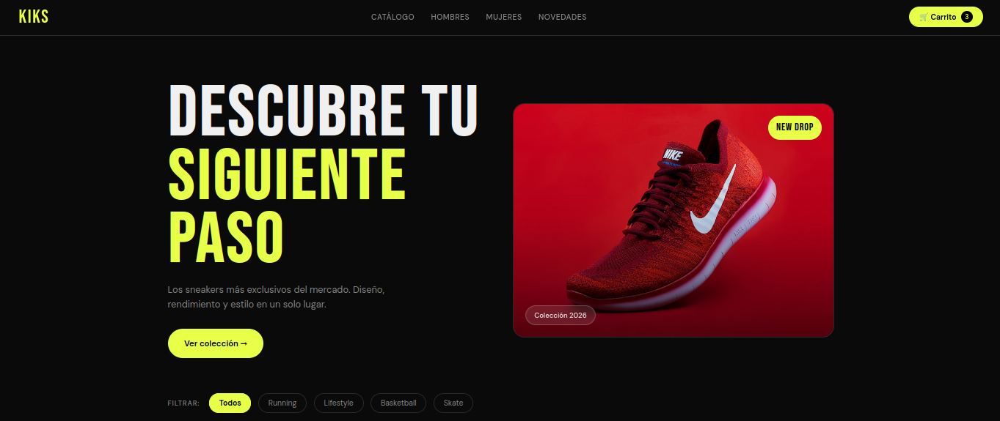
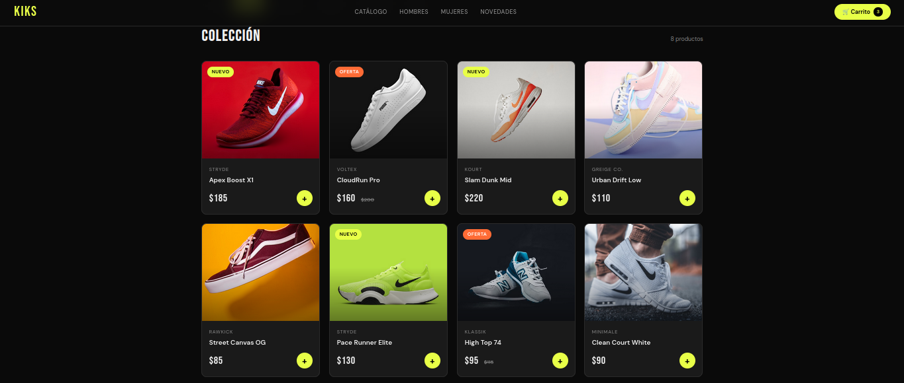
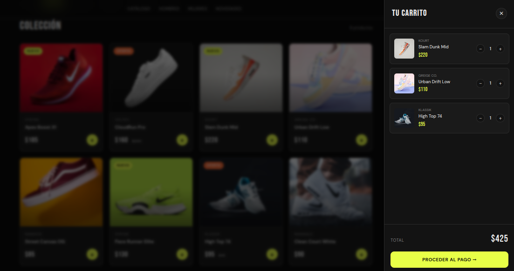
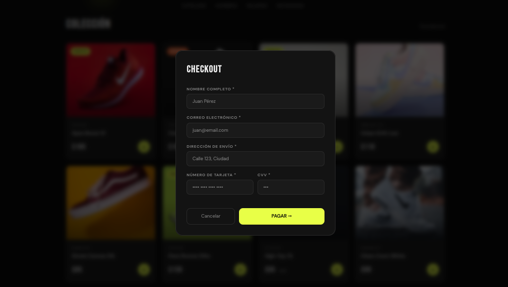

# KIKS — Sneaker Store

> Proyecto de Diseño UX/UI · E-Commerce · HTML / CSS / JavaScript


---

## 📋 Descripción

**KIKS** es una tienda de sneakers desarrollada como demostración práctica de principios de UX/UI aplicados a un e-commerce real. El proyecto cubre el flujo completo del usuario: desde el catálogo hasta el checkout con validación de formularios.

---

## Funcionalidades

- 🛍️ **Catálogo de productos** con 8 sneakers y datos reales
- 🔍 **Filtros por categoría** (Running, Lifestyle, Basketball, Skate)
- 🛒 **Carrito funcional** con persistencia en `localStorage`
- ➕➖ **Control de cantidad** por producto
- 💳 **Checkout con validación** de formulario en tiempo real
- ✅ **Pantalla de confirmación** de orden
- ♿ **Accesibilidad** (ARIA labels, focus visible, roles semánticos)
- 📱 **Diseño responsivo** adaptable a móvil

---

## Cómo ejecutar el proyecto

### Opción 1 — Directamente en el navegador (más simple)

```bash
# 1. Clona el repositorio
git clone https://github.com/cgz-source/KIKS-Sneaker-Store.git

# 2. Entra a la carpeta
cd kiks-sneaker-store

# 3. Abre el archivo en tu navegador
# En macOS:
open index.html

# En Windows:
start index.html

# En Linux:
xdg-open index.html
```

### Opción 2 — Con servidor local (recomendado para desarrollo)

```bash
# Con VS Code + extensión Live Server:
# Click derecho en index.html → "Open with Live Server"

# Con Python (si lo tienes instalado):
python -m http.server 3000
# Luego abre: http://localhost:3000

# Con Node.js (npx):
npx serve .
# Luego abre: http://localhost:3000
```

---

## Estructura del proyecto

```
KIKS-Sneaker-Store/
│
├── index.html          ← Aplicación completa (HTML + CSS + JS)
├── README.md           ← Este archivo
└── Imágenes/           ← Imágenes adicionales
```

> El proyecto usa una arquitectura de **Single File App** — todo el HTML, CSS y JavaScript está en `index.html` para facilitar la demostración y el despliegue.

---

## Tecnologías utilizadas

| Tecnología | Uso | Justificación |
|---|---|---|
| **HTML5 semántico** | Estructura y accesibilidad | Tags `<nav>`, `<main>`, `<article>`, `<aside>` mejoran SEO y accesibilidad |
| **CSS3 + Variables** | Diseño y temas | Variables CSS para consistencia visual y mantenibilidad |
| **JavaScript Vanilla** | Lógica de la app | Sin dependencias externas, carga instantánea |
| **localStorage API** | Persistencia del carrito | Los datos sobreviven al cerrar/abrir el navegador |
| **Google Fonts** | Tipografía (Bebas Neue + DM Sans) | Identidad visual fuerte y legibilidad |
| **ARIA / WAI** | Accesibilidad | Cumplimiento de estándares WCAG 2.1 |

---

## Decisiones de UX/UI

### ¿Por qué SPA y no SSR?

Este proyecto usa una arquitectura **SPA (Single Page Application)** en lugar de SSR (Server-Side Rendering) por las siguientes razones:

- **Sin backend requerido**: El proyecto es una demostración, no necesita servidor
- **Interacciones rápidas**: El carrito y los filtros responden al instante sin recargas
- **Simplicidad de despliegue**: Un solo archivo HTML funciona en cualquier entorno

> Para una tienda real en producción con SEO crítico, se recomendaría **Next.js (SSR/SSG)** para indexación en buscadores.

### Principios UX aplicados

- **Feedback inmediato**: El botón "+" anima al agregar, hay toast notifications
- **Prevención de errores**: Validación de formulario antes de enviar
- **Consistencia visual**: Sistema de colores con variables CSS
- **Accesibilidad**: Todos los elementos interactivos tienen labels ARIA

---

## Herramientas de desarrollo usadas

### Consola del navegador
```javascript
// Ver estado del carrito en tiempo real:
JSON.parse(localStorage.getItem('kiks_cart'))

// Limpiar carrito:
localStorage.removeItem('kiks_cart'); location.reload()
```

### Lighthouse (accesibilidad)
Abrir DevTools → Lighthouse → Accessibility Audit

### Test de filtros por consola
```javascript
// Verificar productos filtrados:
products.filter(p => p.category === 'running')
```

---

## 📸 Demostración visual del proyecto

### Interfaz Principal


### Productos


### Carrito de compra


### Checkout



